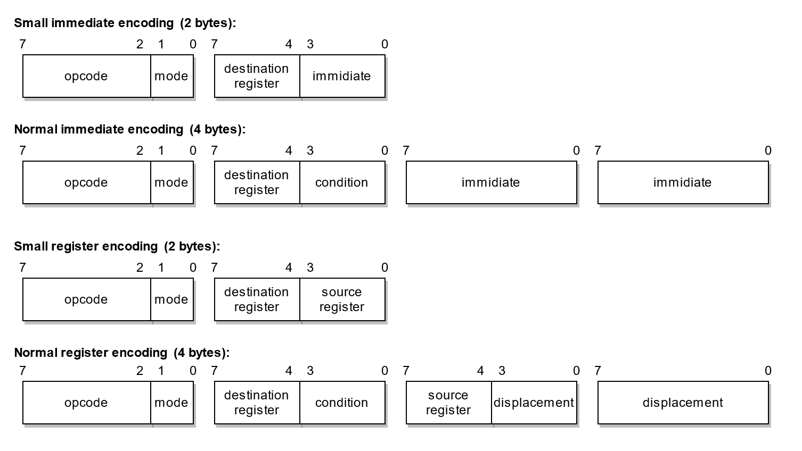

# The Zaheer 16-bit Processor
This is an cutdown version of the Kora processor which is the sucessor to the Neva Processor that can be used as a simple microcontroller or as a simple home processor like the 6502.

## Features
- Simple flexible 16-bit CISC architecture with some RISC features
- 16 registers of which 13 are general purpose
- 16-bit address space (64 KiB)
- 16-bit data interface with the memory
- Variable instruction length (2 bytes or 4 bytes)
- Every instruction can be conditional executed
- All external I/O must be memory based
- One processor hardware interrupt line

## Insperations
- Many registers for an efficient calling convention: ARM, RISC-V
- Memory read posibility in every instruction: x86
- Conditional code for every instruction: ARM
- Flags and condition combinations: x86
- A simple processor interrupt system like the 6502
- Standard interupt and reset address vector: 6502

## Special addresses
- Interrupt jump address vector: `0xfffc - 0xfffd`
- Reset jump address vector: `0xfffe - 0xffff`

## Instruction encoding / Modes
Every instruction has an opcode and a mode. The mode are three bits that descrips how the instruction must be read and executed:

```
bit 0 Immidiate/Register
bit 1 Small/Normal
bit 2 Data/Memory read
```



## Registers
The Zaheer processor as 16 registers in total, 13 are for general purpose use and 3 for processor state:

<table>
<tr><th>#</th><th>Names</th><th>Meaning (calling convention)</th></tr>

<tr><td colspan="3"><i>General purpose registers:</i></td></tr>
<tr><td>0</td><td><code>r0</code>, <code>t0</code></td><td>Temporary variable 1 / Variable arguments count register</td></tr>
<tr><td>1</td><td><code>r1</code>, <code>t1</code></td><td>Temporary variable 2 register</td></tr>
<tr><td>2</td><td><code>r2</code>, <code>t2</code></td><td>Temporary variable 3 register</td></tr>
<tr><td>3</td><td><code>r3</code>, <code>t3</code></td><td>Temporary variable 4 register</td></tr>
<tr><td>4</td><td><code>r4</code>, <code>s0</code></td><td>Saved variable 1 register</td></tr>
<tr><td>5</td><td><code>r5</code>, <code>s1</code></td><td>Saved variable 2 register</td></tr>
<tr><td>6</td><td><code>r6</code>, <code>s2</code></td><td>Saved variable 3 register</td></tr>
<tr><td>7</td><td><code>r7</code>, <code>s3</code></td><td>Saved variable 4 register</td></tr>
<tr><td>8</td><td><code>r8</code>, <code>a0</code></td><td>Function argument 1 / Return argument (low word when 32-bit) register</td></tr>
<tr><td>9</td><td><code>r9</code>, <code>a1</code></td><td>Function argument 2 / Return argument (high word when 32-bit) register</td></tr>
<tr><td>10</td><td><code>r10</code>, <code>a2</code></td><td>Function argument 3 register</td></tr>
<tr><td>11</td><td><code>r11</code>, <code>a3</code></td><td>Function argument 4 register</td></tr>
<tr><td>12</td><td><code>r12</code>, <code>bp</code></td><td>Stack base pointer register</td></tr>
<tr><td colspan="3"></td></tr>

<tr><td colspan="3"><i>Processor used registers:</i></td></tr>
<tr><td>13</td><td><code>r13</code>, <code>sp</code></td><td>Stack pointer register</td></tr>
<tr><td>14</td><td><code>r14</code>, <code>ip</code></td><td>Instruction pointer register</td></tr>
<tr><td>15</td><td><code>r15</code>, <code>flags</code></td><td>Flags register</td></tr>
</table>

## Flag register bits
The Zaheer processor has general flags and processor state flags, all flags are stored in the `flags` register:

<table>
<tr><th>#</th><th>Name</th><th>Meaning</th></tr>

<tr><td colspan="4"><i>General flags:</i></td></tr>
<tr><td>0</td><td>Carry</td><td>Is set when a carry overflow occurs</td></tr>
<tr><td>1</td><td>Zero</td><td>Is set when the result is zero</td></tr>
<tr><td>2</td><td>Sign</td><td>Is set when the sign bit is set</td></tr>
<tr><td>3</td><td>Overflow</td><td>Is set when a overflow occurs</td></tr>
<tr><td colspan="4"></td></tr>

<tr><td>4/7</td><td><i>Reserved</i></td><td>-</td></tr>
<tr><td colspan="4"></td></tr>

<tr><td colspan="4"><i>Processor state flags:</i></td></tr>
<tr><td>8</td><td>Halt</td><td>When set halts the processor</td></tr>
<tr><td>9</td><td>Interrupt</td><td>When set the processor enables interrupts</td></tr>
<tr><td colspan="4"></td></tr>

<tr><td>10/15</td><td><i>Reserved</i></td><td>-</td></tr>
</table>

## Conditions

<table>
<tr><th>#</th><th>Name</th><th>Meaning</th><th>Other names</th><th>Condition</th></tr>

<tr><td>0</td><td><code>-</code></td><td>Always</td><td>-</td><td><code>true</code></td></tr>
<tr><td>1</td><td><code>-n</code></td><td>Never</td><td>-</td><td><code>false</code></td></tr>
<tr><td colspan="5"></td></tr>

<tr><td>2</td><td><code>-c</code></td><td>Carry</td><td><code>-b</code> Below (unsigned)<br/><code>-nae</code> Not above or equal (unsigned)</td><td><code>carry</code></td></tr>
<tr><td>3</td><td><code>-nc</code></td><td>Not carry</td><td><code>-nb</code> Not below (unsigned)<br/><code>-ae</code> Above or equal (unsigned)</td><td><code>!carry</code></td></tr>
<tr><td colspan="5"></td></tr>

<tr><td>4</td><td><code>-z</code></td><td>Zero</td><td><code>-e</code> Equal</td><td><code>zero</code></td></tr>
<tr><td>5</td><td><code>-nz</code></td><td>Not zero</td><td><code>-ne</code> Not equal</td><td><code>!zero</code></td></tr>
<tr><td colspan="5"></td></tr>

<tr><td>6</td><td><code>-s</code></td><td>Sign</td><td>-</td><td><code>sign</code></td></tr>
<tr><td>7</td><td><code>-ns</code></td><td>Not sign</td><td>-</td><td><code>!sign</code></td></tr>
<tr><td colspan="5"></td></tr>

<tr><td>8</td><td><code>-o</code></td><td>Overflow</td><td>-</td><td><code>overflow</code></td></tr>
<tr><td>9</td><td><code>-no</code></td><td>Not Overflow</td><td>-</td><td><code>!overflow</code></td></tr>
<tr><td colspan="5"></td></tr>

<tr><td>10</td><td><code>-a</code></td><td>Above</td><td><code>-nbe</code> Not below or equal (unsigned)</td><td><code>!carry &amp;&amp; !zero</code></td></tr>
<tr><td>11</td><td><code>-na</code></td><td>Not above</td><td><code>-be</code> Below or equal (unsigned)</td><td><code>carry || zero</code></td></tr>
<tr><td colspan="5"></td></tr>

<tr><td>12</td><td><code>-l</code></td><td>Less</td><td><code>-nge</code> Not greater or equal (signed)</td><td><code>sign != overflow</code></td></tr>
<tr><td>13</td><td><code>-nl</code></td><td>Not less</td><td><code>-ge</code> Greater or equal (signed)</td><td><code>sign == overflow</code></td></tr>
<tr><td colspan="5"></td></tr>

<tr><td>14</td><td><code>-g</code></td><td>Greater</td><td><code>-nle</code> Not less or equal (signed)</td><td><code>zero &amp;&amp; (sign == overflow)</code></td></tr>
<tr><td>15</td><td><code>-ng</code></td><td>Not greater</td><td><code>-le</code> Less or equal (signed)</td><td><code>!zero || (sign != overflow)</code></td></tr>
</table>

## Instruction opcodes
An instruction sets only the processor flags when the condition is set to `-` (always) or if the opcode is the `cmp` or `test` instruction:

<table>
<tr><th>#</th><th>Name</th><th>Meaning</th><th>Operation</th><th>Flags</th></tr>

<tr><td colspan="5"><i>Load and store instructions (6):</i></td></tr>
<tr><td>0</td><td><code>nop</code></td><td>No operation</td><td>-</td><td>-</td></tr>
<tr><td>1</td><td><code>lw</code></td><td>Load word (16-bit)</td><td><code>dest = data</code></td><td><code>z</code>, <code>s</code></td></tr>
<tr><td>2</td><td><code>lb</code></td><td>Load unsigned byte (8-bit)</td><td><code>dest = data &amp; 0x00ff</code></td><td><code>z</code>, <code>s</code></td></tr>
<tr><td>3</td><td><code>lbs</code></td><td>Load signed byte (8-bit)</td><td><code>dest = signed(data &amp; 0x00ff)</code></td><td><code>z</code>, <code>s</code></td></tr>
<tr><td>4</td><td><code>sw</code></td><td>Store word (16-bit) to memory <code>(mem=1)</code></td><td><code>[data] = dest</code></td><td>-</td></tr>
<tr><td>5</td><td><code>sb</code></td><td>Store word (8-bit) to memory <code>(mem=1)</code></td><td><code>[data] = dest &amp; 0x00ff</code></td><td>-</td></tr>
<tr><td colspan="5"></td></tr>

<tr><td colspan="5"><i>Arithmetic instructions (6):</i></td></tr>
<tr><td>6</td><td><code>add</code></td><td>Add</td><td><code>dest += data</code></td><td><code>c</code>, <code>z</code>, <code>s</code>, <code>o</code></td></tr>
<tr><td>7</td><td><code>adc</code></td><td>Add with carry</td><td><code>dest += data + carry</code></td><td><code>c</code>, <code>z</code>, <code>s</code>, <code>o</code></td></tr>
<tr><td>8</td><td><code>sub</code></td><td>Subtract</td><td><code>dest -= data</code></td><td><code>c</code>, <code>z</code>, <code>s</code>, <code>o</code></td></tr>
<tr><td>9</td><td><code>sbb</code></td><td>Subtract with borrow</td><td><code>dest -= data + carry</code></td><td><code>c</code>, <code>z</code>, <code>s</code>, <code>o</code></td></tr>
<tr><td>10</td><td><code>neg</code></td><td>Negate</td><td><code>dest = -data</code></td><td><code>c</code>, <code>z</code>, <code>s</code>, <code>o</code></td></tr>
<tr><td>11</td><td><code>cmp</code></td><td>Arithmetic compare (sub)</td><td><code>dest - data (always set flags)</code></td><td><code>c</code>, <code>z</code>, <code>s</code>, <code>o</code></td></tr>
<tr><td colspan="5"></td></tr>

<tr><td colspan="5"><i>Bitwise instructions (8):</i></td></tr>
<tr><td>12</td><td><code>and</code></td><td>Logical and</td><td><code>dest &amp;= data</code></td><td><code>z</code>, <code>s</code></td></tr>
<tr><td>13</td><td><code>or</code></td><td>Logical or</td><td><code>dest |= data</code></td><td><code>z</code>, <code>s</code></td></tr>
<tr><td>14</td><td><code>xor</code></td><td>Logical xor</td><td><code>dest ^= data</code></td><td><code>z</code>, <code>s</code></td></tr>
<tr><td>15</td><td><code>not</code></td><td>Logical not</td><td><code>dest = ~data</code></td><td><code>z</code>, <code>s</code></td></tr>
<tr><td>16</td><td><code>test</code></td><td>Bitwise compare (and)</td><td><code>dest &amp; data (always set flags)</code></td><td><code>z</code>, <code>s</code></td></tr>
<tr><td>17</td><td><code>shl</code></td><td>Logical shift left</td><td><code>dest &lt;&lt;= data &amp; 15</code></td><td><code>z</code>, <code>s</code></td></tr>
<tr><td>18</td><td><code>shr</code></td><td>Logical shift right</td><td><code>dest &gt;&gt;= data &amp; 15</code></td><td><code>z</code>, <code>s</code></td></tr>
<tr><td>19</td><td><code>sar</code></td><td>Arithmetic shift right</td><td><code>dest &gt;&gt;&gt;= data &amp; 15</code></td><td><code>z</code>, <code>s</code></td></tr>
<tr><td colspan="5"></td></tr>

<tr><td colspan="5"><i>Stack instructions (4):</i></td></tr>
<tr><td>20</td><td><code>push</code></td><td>Push word (16-bit) on the stack <code>(mem=0)</code></td><td><code>[sp] = data, sp -= 2</code></td><td>-</td></tr>
<tr><td>21</td><td><code>pop</code></td><td>Pop word (16-bit) of the stack <code>(mem=1)</code></td><td><code>dest = [sp + 2], sp += 2</code></td><td><code>z</code>, <code>s</code></td></tr>
<tr><td>22</td><td><code>call</code></td><td>Call relative subroutine <code>(dest=0, mem=0)</code></td><td><code>[sp] = ip, sp -= 2, ip += data</code></td><td>-</td></tr>
<tr><td>22</td><td><code>call</code></td><td>Call absolute subroutine <code>(dest=1, mem=0)</code></td><td><code>[sp] = ip, sp -= 2, ip = data</code></td><td>-</td></tr>
<tr><td>23</td><td><code>ret</code></td><td>Return from subroutine <code>(mem=1)</code></td><td><code>ip = [sp + 2], sp += 2 + data</code></td><td>-</td></tr>
<tr><td colspan="5"></td></tr>

<tr><td>24/31</td><td><i>Reserved</i></td><td>-</td><td>-</td><td>-</td></tr>
</table>

## Pseudo instructions
Some instructions are assembled as diffrent instructions because they don't exists:

```
mov t0, 5   ->      lw t0, 5
jmp 4       ->      mov ip, 4
inc t0      ->      add t0, 1
dec t0      ->      sub t0, 1
```

## Simple loop assembly example
This is a simple example of a loop program and the instruction sizes are in the comments on the right:

```
    mov t0, 0       ; 2 bytes
repeat:
    cmp t0, 10      ; 2 bytes
    jmpeq done      ; 4 bytes (condition code) -> moveq ip, done
    inc t0          ; 2 bytes -> add t0, 1
    jmp repeat      ; 2 bytes
done:
```
